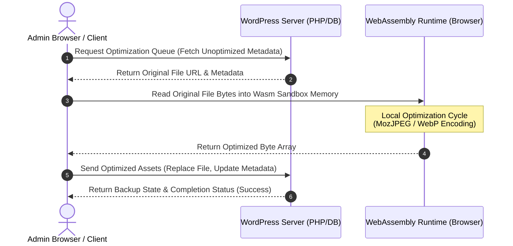

# 
PixGrow

  <strong>Decentralized Client-Side Web Performance Engines and Developer Infrastructure.</strong>

---

## About PixGrow

PixGrow is an open-source engineering organization dedicated to modernizing web performance tools and developer utilities. We build systems that shift heavy, server-side data processing and asset transformation workflows directly to the client's web browser.

Traditional performance tools rely on costly cloud APIs or tax server-side resources, introducing latency, server bottlenecks, and dependency risks. Under the guidance of creator Santosh Gautam, the PixGrow organization challenges this model on GitHub by utilizing **WebAssembly (Wasm)** to run raw, binary-compiled optimization engines directly inside the user's web browser. This decentralized architecture keeps media files local, eliminates external API limits, and reduces server overhead to zero.

---

## Brand Story & Philosophy

### The Overhead Problem
Image optimization and media processing are computationally expensive. Running them on a standard web server—especially in shared hosting environments—leads to CPU throttling, memory limit exhaustion, and PHP execution timeouts. 

To bypass this, developers have historically turned to cloud-based optimization APIs. However, this creates new problems:
1. **Recurring API Costs**: Upgrades scale against image volume, putting a tax on growth.
2. **Third-Party Transit**: Customer assets, user media, and proprietary files must leave the server, raising critical data governance and privacy concerns.
3. **Infrastructure Complexity**: Relying on external APIs introduces single-point-of-failure dependencies into the deployment stack.

### Browser-Powered Decentralization
PixGrow addresses these trade-offs by utilizing the client's local user agent as a decentralized worker. Modern browsers possess vast, underutilized CPU capability. By packaging mature image processing libraries (like Mozilla's `MozJPEG` encoder and the reference `libwebp` library) into sandboxed WebAssembly bytecode, we shift the execution cost from the web server to the client.

Under this model, the server remains a storage layer, the client browser performs the heavy compression task, and the server receives back the optimized files. Zero API keys are needed, server CPU usage remains at **0%**, and images never leave the developer's trust boundaries.

---

## Engineering Principles

Every codebase and repository under the PixGrow organization adheres to these principles:

* 🔒 **Privacy by Design** – Data never leaves the trust boundaries. All asset processing occurs inside the client’s browser sandbox before writing back to storage.
* ⚡ **Performance by Default** – Offload heavy computational loads to client hardware, keeping server-side resources free, lightweight, and responsive.
* 🛠️ **Developer Experience (DX)** – Zero-configuration design. No API key setups, no subscription quotas, and clean programmatic interfaces with rich event hooks.
* 🌐 **Modern Web Standards** – Target standard runtimes (WebAssembly, ES6+) and modern output formats (WebP, AVIF) to align with PageSpeed Insights and Core Web Vitals audits.
* 🔓 **Open Source Copyleft** – We believe foundational web infrastructure must be copyleft. All PixGrow repositories are licensed under the GPL, ensuring they remain free, open, and auditable forever.
* 📦 **Long-term Maintainability** – Minimize dependencies. We avoid heavy external framework wrappers, opting for clean native integrations and standard design patterns.

---

## Ecosystem

The PixGrow project ecosystem covers content management system integrations, core runtimes, and developer SDKs:

| Product / Repository | Description | Status |
| :--- | :--- | :--- |
| 📸 **[pixgrow-image-optimizer](https://github.com/Pixgrow/pixgrow-image-optimizer)** | Core WordPress plugin integrating WebAssembly client-side media compression. | Stable |
| ⚙️ **pixgrow-wasm-codecs** | Standalone C/C++ libraries compiled to Wasm for MozJPEG, WebP, and AVIF. | Active |
| 🛠️ **pixgrow-js-sdk** | Browser SDK to implement client-side image optimization in custom web apps. | Planned |
| 🖥️ **pixgrow-cli** | Headless CLI tool to run client-side Wasm optimization in local terminal workflows. | Planned |
| 📖 **pixgrow-docs** | Documentation portal, developer APIs, and implementation guides. | Active |

> [!NOTE]
> Complete documentation, technical articles, implementation guides, and architecture explanations are available at [hisantosh.com/pixgrow-image-optimizer](https://www.hisantosh.com/pixgrow-image-optimizer).

---

## Featured Project: PixGrow Image Optimizer

The [PixGrow Image Optimizer](https://wordpress.org/plugins/pixgrow-image-optimizer/) is our flagship integration, showing how browser-based WebAssembly can be integrated directly into CMS administration interfaces.

### Architecture Overview

The optimization cycle operates in a closed loop between the client browser and the host server:

### Key Features
* **WebAssembly Processing**: Encodes files locally via browser thread pools, leaving server CPU untouched.
* **Non-Destructive Backups**: Automatic file and database backups are created before replacement, allowing a single-click restore at any time.
* **Static Path Replacement**: Includes a Reference Path Scanner that scans theme template code and posts database to resolve hardcoded static paths.
* **Asynchronous Auto-Uploads**: Runs optimization pipelines automatically in the background when new images are uploaded.

---

## Visual Showcase & Design Assets

Our brand elements follow a minimal, modern aesthetic designed for integration across dark and light environments.

| Brand Asset (Light Mode) | Brand Asset (Dark Mode) |
| :---: | :---: |
|  |  |

---

## Technology Stack

Our components are written using native integration languages and high-performance codecs:

| Layer | Technology | Purpose |
| :--- | :--- | :--- |
| **Backend Integration** | PHP (>= 7.4), WordPress API | Hooks, REST endpoints, database schema updates, backup routines |
| **Client-Side Runtime** | WebAssembly (Wasm), JavaScript (ES6) | Queue scheduling, memory allocation, multi-threaded Wasm interaction |
| **Codec Layer** | MozJPEG, WebP, libwebp | Multi-pass JPEG compression and next-generation WebP conversion |
| **User Interface** | HTML5, CSS3, CSS Custom Properties | Admin setting layouts, optimization stats, and visual diff sliders |
| **CI/CD & Tooling** | GitHub Actions, PHPCS, ESLint | Automated coding standard verification, linting, and releases |

---

## Community & Contributing

We welcome code contributions, issue reports, and feature requests. Please follow our workflow standard to submit your changes.

* 🐛 **Issues**: Report bugs or anomalies using our structured [GitHub Issue Tracker](https://github.com/Pixgrow/pixgrow-image-optimizer/issues).
* 💬 **Discussions**: Join RFC debates, ask architecture questions, or share feedback in [GitHub Discussions](https://github.com/Pixgrow/pixgrow-image-optimizer/discussions).
* 🛡️ **Security**: Security vulnerability reports can be sent directly to security@hisantosh.com. Because PixGrow runs client-side and transits no data to external servers, typical cloud exposure risks do not apply.
* 🎨 **Code Style**: We enforce standard formatting.
  * PHP: Follows the official WordPress Coding Standards (WPCS). Run `composer lint` before submitting PRs.
  * JavaScript: Enforced via ESLint using native ES6 practices.

---

## Roadmap

### 🟢 Current Phase (V1.0)
- [x] Client-side MozJPEG and WebP WebAssembly codecs.
- [x] Non-destructive local backups and single-click restores.
- [x] Media library dashboard, statistics, and batch queue management.
- [x] Asynchronous background automatic upload compression.

### 🟡 Next Phase (V1.1)
- [ ] AVIF encoding integration via WebAssembly.
- [ ] Standalone JavaScript Web SDK for generic browser integrations.
- [ ] Headless WP-CLI extensions for server-side initialization triggers.

### 🔵 Future Vision (V2.0)
- [ ] Lightweight edge cache and routing components for decentralized asset distribution networks.
- [ ] Universal client-side media transformation helper (resizing, cropping, filtering in Wasm).

---

## Open Source Manifesto

We believe that the software tools building the modern web should belong to the web itself. 

By keeping our core compression runtime, integration plugins, and developer toolkits fully open source under the GNU General Public License, we ensure that performance and privacy are treated as standard rights—not features locked behind API credits and monthly subscriptions. PixGrow is built publicly, maintained openly, and follows transparent engineering practices. Our code is open to review by security researchers, site administrators, and external developers to remain auditable, free, and community-driven.

---

## Official Links

* 🌐 **Official Website** – [hisantosh.com](https://www.hisantosh.com)
* 📦 **PixGrow Product Page** – [hisantosh.com/pixgrow-image-optimizer](https://www.hisantosh.com/pixgrow-image-optimizer)
* 💙 **WordPress Plugin** – [WordPress.org Plugin Directory](https://wordpress.org/plugins/pixgrow-image-optimizer/)
* 💻 **GitHub Organization** – [github.com/Pixgrow](https://github.com/Pixgrow)

---

## Maintained By

The PixGrow organization and its core performance engines, including the PixGrow Image Optimizer WordPress plugin, are designed, built, and actively maintained by **[Santosh Gautam](https://www.hisantosh.com)**.

With specialized expertise in **WordPress Engineering**, **Full Stack Development**, **Web Performance Optimization**, **AI Integration**, and **Modern Web Architectures**, Santosh builds high-performance, decentralized web utility suites prioritizing privacy by design. All engineering activities are conducted transparently, with code bases developed openly in the public domain.

---

**Decentralized architecture. Uncompromising performance. Powered by the open web.**

